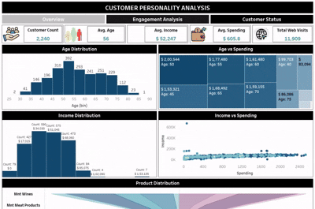

# Customer Personality Analysis 🎯🚀

**Customer Personality Analysis** is an in-depth study of a company’s ideal customers, enabling businesses to tailor their products and marketing strategies based on specific customer segments. By understanding customers’ needs, behaviors, and concerns, companies can optimize their offerings, target the right audience, and improve overall profitability.

---

## Demo

Check out the demo of the meeting scheduler in action:

---

## Table of Contents 📖
1. [Project Overview](#project-overview)
2. [Time Line & Methodology](#time-line--methodology)
3. [Data Analysis & Machine Learning](#data-analysis--machine-learning)
4. [Tableau Dashboards](#tableau-dashboards)
   - [1. Overview Dashboard](#1-overview-dashboard)
   - [2. Engagement Analysis Dashboard](#2-engagement-analysis-dashboard)
   - [3. Family Structure & Customer Status Dashboard](#3-family-structure--customer-status-dashboard)
5. [Results & Insights](#results--insights)
6. [Conclusion](#conclusion)

---

## Project Overview 💡

In this project, we explore:
- **Customer Segmentation & Personality Analysis**: Identify different customer segments based on demographics, spending habits, and engagement metrics.  
- **Product & Campaign Optimization**: Target marketing efforts and product development more effectively by understanding which segments are most likely to respond.  
- **Data-Driven Insights**: Use visual storytelling and advanced analytics to uncover patterns in spending, income, family structure, and more.

The project includes a comprehensive **Jupyter Notebook** for data cleaning, visualization, statistical analysis, feature engineering, and both **unsupervised (clustering)** and **supervised (classification)** machine learning approaches. Additionally, an interactive **Tableau Dashboard** was created to present key insights at a glance.

---

## Time Line & Methodology ⏳🔬

1. **Importing Libraries**  
   - Set up the environment and import essential libraries (e.g., pandas, numpy, matplotlib, seaborn, scikit-learn).

2. **Data Analysis**  
   - Explore the dataset to understand distributions, missing values, and outliers.  
   - Perform initial statistical analysis to gauge relationships between variables.

3. **Data Cleaning & Feature Engineering** 🧹🏗️  
   - Handle missing data and outliers.  
   - Create new features (e.g., total spending, average income, family size).  
   - Encode categorical variables for model readiness.

4. **Clustering (Unsupervised Learning)**  
   - Use the **Elbow Method** to determine the optimal number of clusters.  
   - Perform **k-means** clustering to segment customers into groups.

5. **Supervised Learning Approach** 🤖  
   - Build classification models (e.g., **Decision Tree**, **KNN**, **Random Forest**) to predict customer behaviors or responses to campaigns.  
   - Tune hyperparameters and evaluate performance using metrics like accuracy, precision, and recall.

---

## Data Analysis & Machine Learning 🤝💻

In the accompanying **Jupyter Notebook**, you’ll find:

- **Detailed Data Cleaning**: Step-by-step handling of null values, duplicates, and irrelevant features.  
- **Data Visualization**: Exploratory charts (histograms, boxplots, pairplots) to understand distributions and relationships.  
- **Statistical Analysis**: Summary statistics and hypothesis testing to validate insights.  
- **Feature Engineering**: Creation of meaningful variables (e.g., total purchase channels, total spending, average monthly income).  
- **Clustering**:  
  - **Elbow Method** to decide optimal k.  
  - **k-Means** for segmenting customers into homogeneous groups.  
- **Classification Models**:  
  - **Decision Tree**, **KNN**, and **Random Forest** to predict outcomes such as campaign responses or likelihood to complain.

---

## Tableau Dashboards 📊✨

Below are brief explanations of the **Tableau Dashboards** created for an interactive and visual exploration of the data. The screenshots illustrate how you can quickly glean insights into customer demographics, spending, and engagement.

### 1. Overview Dashboard 🏷️

- **Age Distribution & Average Age**: Understand the primary age groups of customers.  
- **Age vs. Spending**: Visualize how different age brackets correlate with spending levels.  
- **Income Distribution & Income vs. Spending**: Identify income ranges and how they influence purchasing behavior.  
- **Product Distribution**: Explore which product categories drive the most sales.  
- **Purchase Channels**: Examine online vs. in-store purchases with respect to marital status and education.

### 2. Engagement Analysis Dashboard 📣

- **Number of Complaints & Complaints vs. Spending**: Gauge how customer dissatisfaction impacts spending.  
- **Response by Marital Status**: See which demographic segments respond best to marketing campaigns.  
- **Customer Monthly Recency**: Track how recently customers made a purchase.  
- **Campaign Analysis**: Dive into the performance of various campaigns (First, Second, Third, Fourth, Fifth) and see how they correlate with spending.  
- **Number of Deals Purchases vs. Spending**: Understand how deals or promotions influence customer spending.  
- **Number of Web Visits (Last Month)**: Assess online engagement levels.

### 3. Family Structure & Customer Status Dashboard 🏠👨‍👩‍👧‍👦

- **Marital Status Distribution & Marital Status vs. Spending**: Analyze spending patterns across different marital statuses.  
- **Education Distribution & Education vs. Spending**: Understand the relationship between education levels and purchasing behavior.  
- **Number of Kids vs. Average Income & Number of Teens vs. Average Income**: See how family composition impacts household income.  
- **Family Size vs. Spending**: Correlate total family members with average spending.  
- **Basic Information Cards**: Quick stats summarizing key metrics (e.g., total customers, total spend, average age, etc.).

---

## Results & Insights 🏆

1. **Customer Segments**  
   - Distinct groups emerged (e.g., high-income families, young professionals, large families with moderate income), each requiring different marketing strategies.
2. **Campaign Performance**  
   - Some campaigns resonated better with specific segments, resulting in higher response and spending.
3. **Complaints & Satisfaction**  
   - Customers with frequent complaints tend to spend less over time, underscoring the importance of customer service.
4. **Family Structure**  
   - Families with multiple children often seek budget-friendly products and promotions.
5. **Spending vs. Age/Income**  
   - While higher-income brackets generally spend more, middle-income segments show significant potential if targeted effectively.

---

## Conclusion 🏁🎉

**Customer Personality Analysis** provides powerful insights into consumer behavior, enabling businesses to:

- **Tailor Product Offerings & Campaigns**: Focus resources where they yield the best returns.  
- **Enhance Customer Satisfaction**: Address pain points identified through complaints and feedback loops.  
- **Optimize Resource Allocation**: Identify high-value or at-risk segments for strategic engagement.

By combining **data analysis**, **machine learning**, and **interactive dashboards**, this project demonstrates how a data-driven approach can significantly improve understanding and segmentation of customers for smarter business decisions.

> *“Without data, you’re just another person with an opinion.” – W. Edwards Deming*

Feel free to explore the **Jupyter Notebook** for the technical details and dive into the **Tableau Dashboards** for a rich, interactive visualization of the insights. Happy analyzing! 🥳
